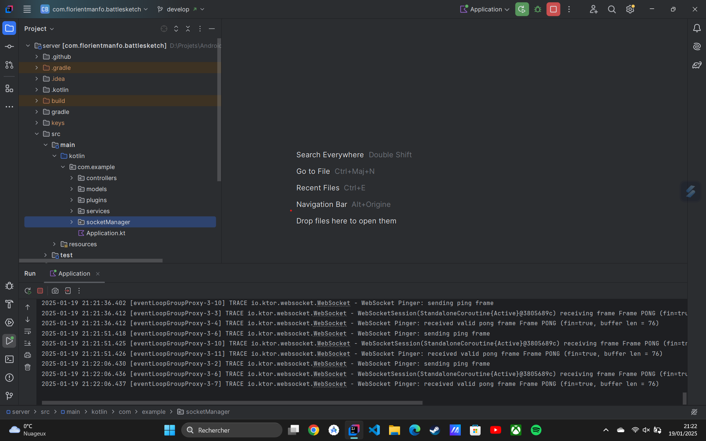

# BattleSketch-client
This is my first Android scribble game, built entirely for learning purposes 🙂

# Description
It is a multiplayer game based on a WebSocket server, where you can:
- Create or join an existing room
- Sketch your thoughts and let other players guess what it is
- Send your suggestions as a message
  It is just a kind of icebreaker game.

# Features
There are many features such as:
- Configure and create your room
- Search and join a room
- Leave a room with or without the ability to close it

# Remarks
To test this project, you need to launch the server which is in this repository: `https://github.com/RosvaldeMANFO/BattleSketch-server.git`
Then update the `local.properties` like this:
 
Here I am running the server on my local host. Make sure the IP address matches your server, in case you have deployed the server on a “VPS”.

# Demo
| Home page                                | Waiting for player                       |
|------------------------------------------|------------------------------------------|
|    |    |

| Board page                             | Server                             |
|----------------------------------------|------------------------------------|                                        
|  |  |

